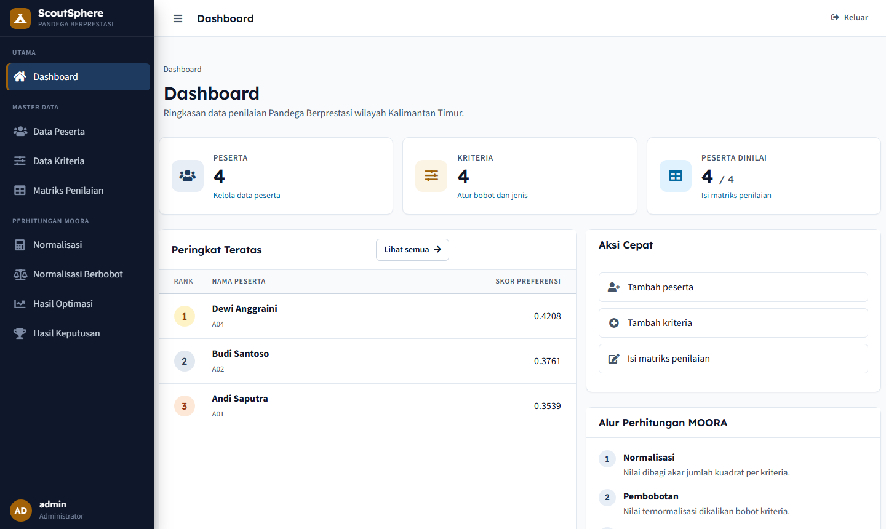
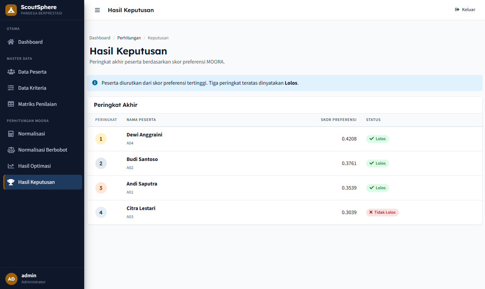
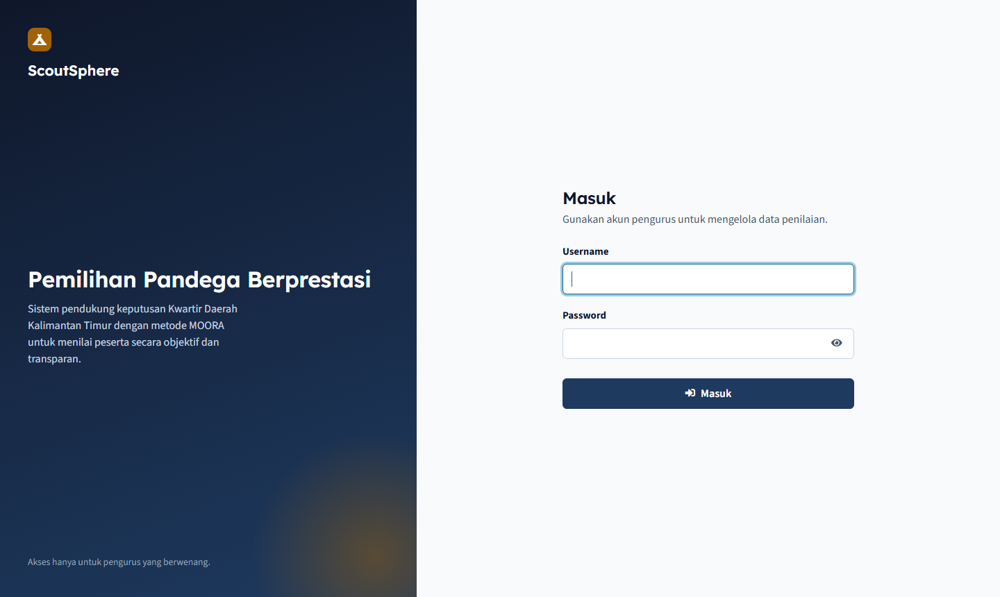
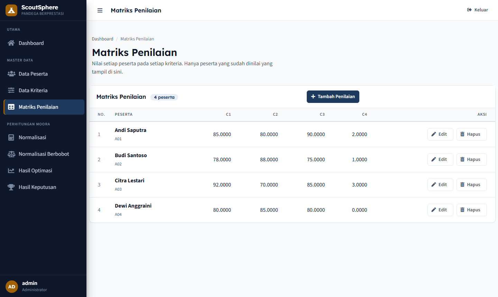

# ScoutSphere

[](https://github.com/tiaraasani/ScoutSphere-MOORA/actions/workflows/ci.yml)


Decision support system that ranks candidates for **Pandega Berprestasi**
(outstanding senior scouts) in East Kalimantan using the MOORA method.
Built with CodeIgniter 4, MySQL, and AdminLTE.



## The problem

Every year the regional scout council selects its best Pandega members from
dozens of candidates scored on several criteria with different weights.
Doing this by hand in spreadsheets is slow, hard to audit, and easy to get
wrong when a weight or score changes. ScoutSphere turns the selection into a
repeatable calculation: enter the criteria, enter the scores, and the ranking
updates instantly.

## How the ranking works

MOORA (Multi-Objective Optimization on the basis of Ratio Analysis) is a
multi-criteria decision method with four steps. Each step is implemented as a
MySQL view that builds on the previous one, so the whole calculation lives in
the database and every page reads a single view.

| Step | View | Formula |
|------|------|---------|
| 1. Normalisation | `view_normalisasi_moora` | x\*ᵢⱼ = xᵢⱼ / √(Σ xᵢⱼ²) |
| 2. Weighting | `view_optimasi_moora` | yᵢⱼ = wⱼ · x\*ᵢⱼ |
| 3. Optimisation | `view_skor_moora` | yᵢ = Σ benefit − Σ cost |
| 4. Ranking | `view_hasil` | order by yᵢ descending |

Criteria are either **benefit** (higher is better, e.g. achievements) or
**cost** (lower is better, e.g. violations). The top three ranks are marked
as accepted.



## Features

- Master data for participants, criteria (with weight and type), and the
  decision matrix, each with server-side validation and inline error messages.
- Calculation pages for every MOORA step, with the formula shown next to the
  numbers so results can be checked by hand.
- Session login with bcrypt password hashing and a constant-time failure path
  that does not reveal whether a username exists.
- CSRF protection on every form, destructive actions only over POST with a
  confirmation dialog.
- Per-IP rate limiting: 60 requests per minute globally, 5 login attempts per
  minute.
- Secure response headers, HTTPS and `Secure` cookies enforced in production.
- Accessible UI: visible labels, keyboard focus rings, skip link, ARIA
  attributes, `prefers-reduced-motion` support, and a 390 px mobile layout.
- Indonesian interface with Indonesian validation messages.

| Login | Matrix |
|-------|--------|
|  |  |

## Tech stack

| Layer | Choice |
|-------|--------|
| Language | PHP 8.2+ (`declare(strict_types=1)` throughout) |
| Framework | CodeIgniter 4.7 |
| Database | MySQL 8 / MariaDB 10.4+ (views), SQLite in tests |
| Front end | AdminLTE 3 / Bootstrap 4 with a token-based theme layer |
| Tests | PHPUnit 10, feature tests against an in-memory database |
| CI | GitHub Actions: `composer audit`, lint, test on PHP 8.2 and 8.3 |

## Getting started

Requirements: PHP 8.2 or newer with `intl`, `mbstring`, `mysqli`; MySQL 8 or
MariaDB 10.4 or newer; Composer.

```bash
composer install
cp .env.example .env        # fill in database credentials and ADMIN_PASSWORD
php spark migrate           # creates all tables and the MOORA views
php spark db:seed AdminUserSeeder
php spark serve             # http://localhost:8080
```

`php spark db:seed SampleDataSeeder` loads four criteria and four
participants so the calculation pages have something to show. Remove
`ADMIN_PASSWORD` from `.env` once the account exists.

For production, point the web server document root at `public/`, set
`CI_ENVIRONMENT = production` and `app.baseURL` in `.env`, and serve over
HTTPS. See [`.env.example`](.env.example) for every setting.

## Project layout

```
app/
  Controllers/   Auth, Alternative, Criteria, Matrix, Home (results)
  Models/        one model per table, plus read-only models for each view
  Filters/       AuthFilter (session guard), ThrottleFilter (rate limit)
  Helpers/       form_ui_helper: inline validation markup
  Database/      migrations (tables + views) and seeders
  Views/         layout, pages, partials (empty state, alerts, form fields)
public/assets/
  css/app.css    design tokens and theme overrides
  js/app.js      confirm dialogs, password toggle, focus handling
tests/
  feature/       authentication, CRUD, matrix, rate limiting
  unit/          form helper
```

## Tests

```bash
composer test
```

Feature tests run the real controllers and filters against an SQLite
in-memory database that is migrated and seeded for every test.

## Security notes

- Every route except `/login` requires an authenticated session.
- Secrets live only in `.env`, which is ignored by git.
- Use a dedicated database user with `SELECT, INSERT, UPDATE, DELETE` only.
- Run `composer audit` before every release; CI fails on any known advisory.

## License

MIT. See [LICENSE](LICENSE).
